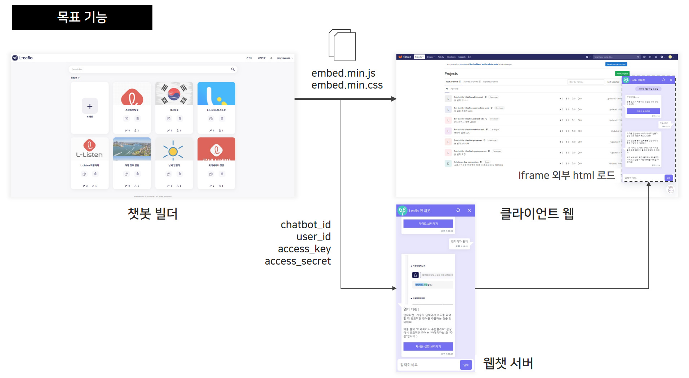
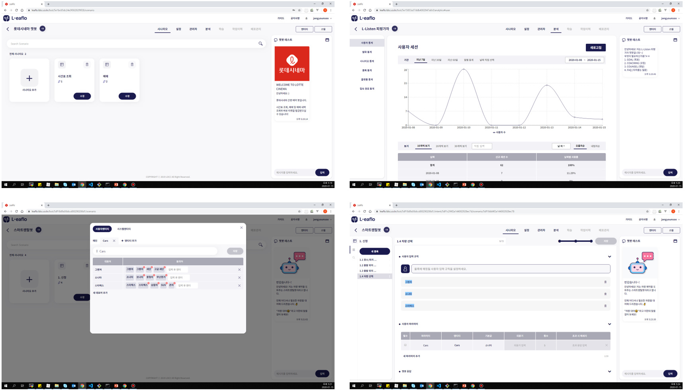
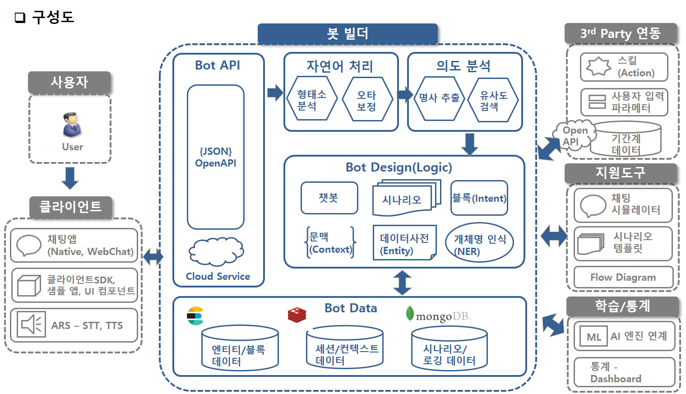
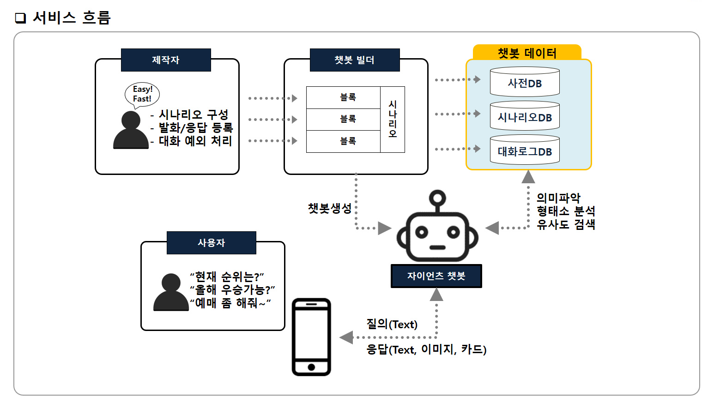

# RESUME

### 전유정, Zoey

github: <https://github.com/yujeongJeon>

blog: <https://coffeeandcakeandnewjeong.tistory.com/>

e-mail: workingnewjeong@gmail.com

------

## 소개

## 기술 이력

## 경력

#### 롯데정보통신 

- 2019.02. ~ 재직 중
- 소속: 정보기술연구소 융합연구센터
- 담당: 서비스연구 담당 | 프론트엔드 개발자

#### [인턴 ]롯데정보통신

- 2018.07. ~ 2018.12.
- 소속: 정보기술연구소 솔루션연구팀
- 수행 프로젝트
  - 면접관 추첨 프로젝트
  - 연구소 과제관리 시스템 PoC
  - 권한관리 시스템 PoC
  - 챗봇 빌더 PoC

## 기술 스택

## 프로젝트

#### (1) 웹챗 SDK

- 2019.12. ~ 2020.01.

- 설명: 챗봇 빌더에서 생성한 챗봇을 웹챗으로 배포하기 위한 SDK입니다.

- 사용 기술: Next.js, Storybook, docker

- 역할

  - 웹챗 UI 구성 및 인터페이스 서버 API 라우팅 100%
  - 웹챗 배포 스크립트 작성 100%

- <https://github.com/yujeongJeon/react-with-next>

  

#### (2) Leaflo 챗봇 빌더

<https://leaflo.ldcc.co.kr/>

- 2018.10. ~ 2018.12. PoC
- 2019.02 ~ 2019.06.  Product 착수, 1차 고도화
- 2019.07 ~ 2019.11. 2차 고도화
- 2019.12.~ 2020.02. 3차 고도화, 2월 중 v1.0 전사 오픈 예정

- 설명: 자연어 처리, 개체명 인식, 사전 등의 다양한 기능을 탑재한 챗봇의 API를 웹을 통해 만들고 관리할 수 있는 서비스입니다.

- 사용기술 및 역할

  

#### (3) 연구소 과제관리 시스템 PoC

- 설명:

#### (4) 면접관 추첨 시스템

- 설명:

#### 

## 대학

#### (1) 콘텐츠 중심 네트워킹을 적용한 무선 센서 네트워크 환경의 미세먼지 통계 예보 시스템

<http://iotlab.skku.edu/publications/domestic-conference/KICS-2018-Content-Micro-Dust.pdf>

#### (2) 실내위치인식 기반 병원 웹앱

