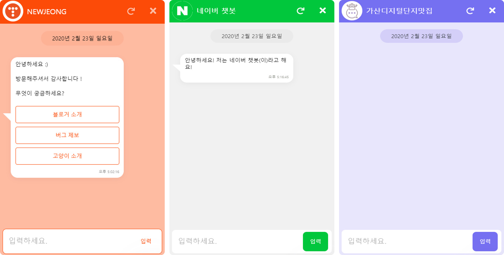
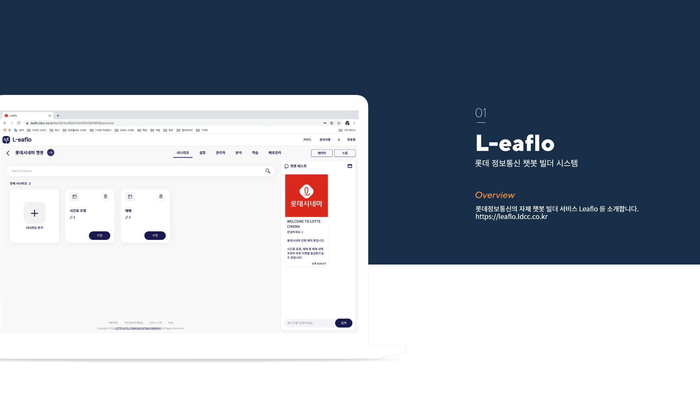
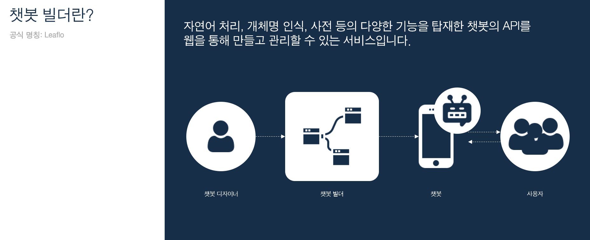
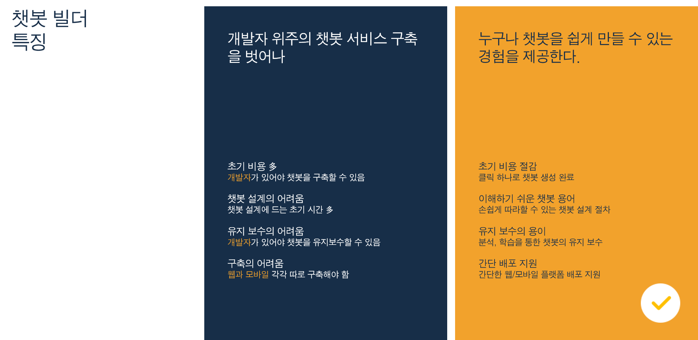
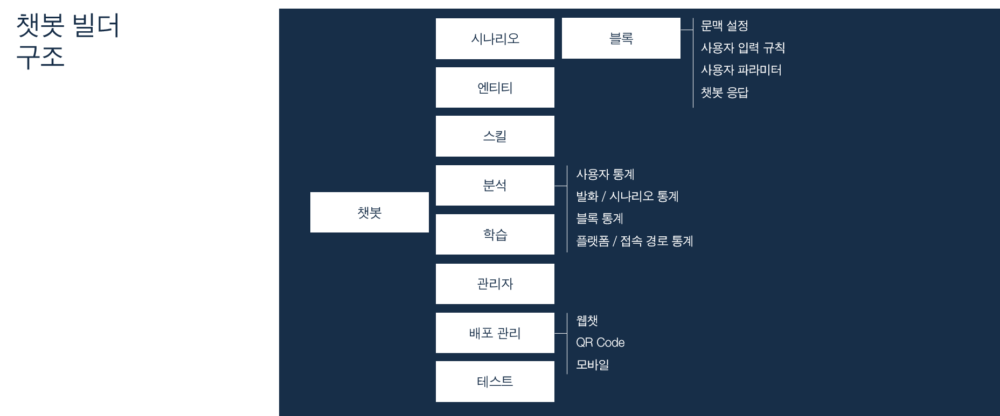
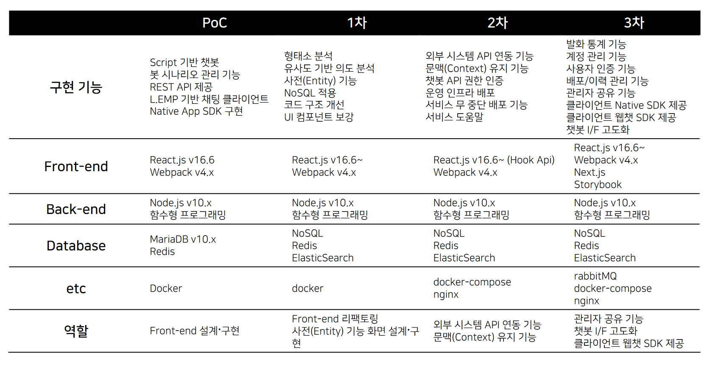
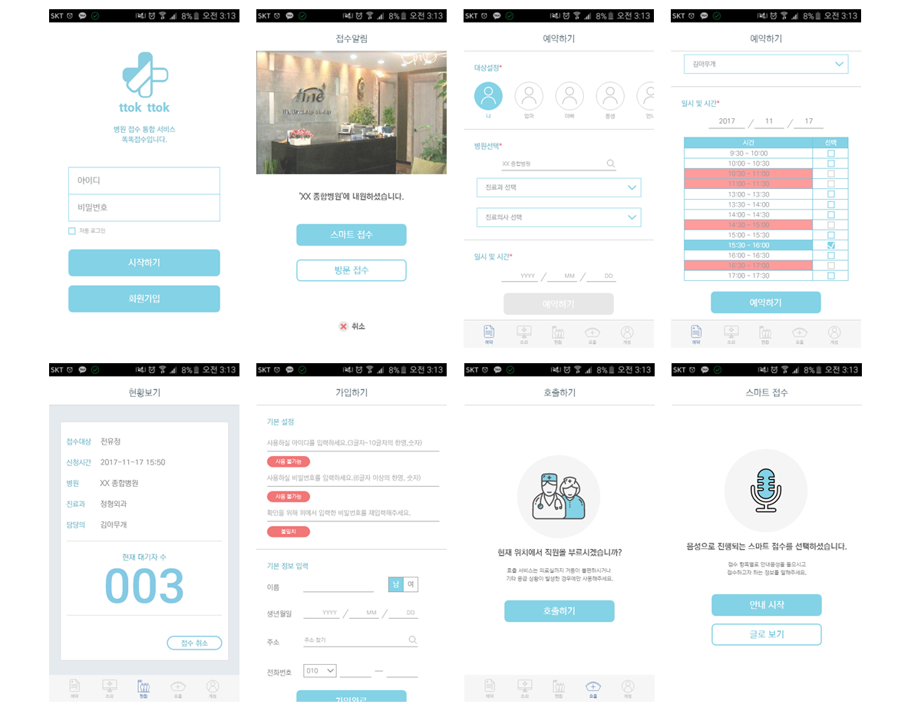

# RESUME

### 전유정, Zoey

github: <https://github.com/yujeongJeon>

blog: <https://coffeeandcakeandnewjeong.tistory.com/>

e-mail: workingnewjeong@gmail.com

------

## 소개

현업에서 근무한지 1년이 되는 프론트엔드 개발자입니다. 롯데정보통신 정보기술연구소에서 React.js 기반의 챗봇 빌더 프론트엔드를 담당하여 1년 동안 연구개발하였습니다. javascript를 가장 좋아하며 코어 자바스크립트 및 외부 교육을 다니며 기본 개념을 꾸준히 학습하고 있습니다. 최근에는 신뢰를 주고 확장 가능한 프론트 엔드 테스트 전략에 관심이 많습니다.

## 기술 이력

## 경력

#### 롯데정보통신 

- 2019.02. ~ 재직 중
- 소속: 정보기술연구소 융합연구센터
- 담당: 서비스연구 담당 | 프론트엔드 개발자

#### [인턴 ]롯데정보통신

- 2018.07. ~ 2018.12.
- 소속: 정보기술연구소 솔루션연구팀
- 수행 프로젝트
  - 면접관 추첨 프로젝트
  - 연구소 과제관리 시스템 PoC
  - 권한관리 시스템 PoC
  - 챗봇 빌더 PoC

## 보유 기술

#### 언어

- javascript

#### 프레임워크

- React.js, Vue.js
- Node.js
- JQuery

#### 데이터베이스

- MongoDB
- MariaDB
- ElasticSearch
- Redis

#### Tools & Env.

- Docker
- Linux, Windows, AWS EC2

## 프로젝트

#### (1) 웹챗 SDK

https://leaflo.ldcc.co.kr:4001/

- 2019.12. ~ 2020.01.

- 설명: import 스크립트를 통해 챗봇 빌더에서 생성한 챗봇을 웹챗으로 배포하기 위한 SDK입니다.

- 사용 기술: Next.js, Storybook, docker

- 역할

  - 웹챗 UI 구성 및 인터페이스 서버 API 라우팅 100%
  - 웹챗 배포 스크립트 작성 100%

- <https://github.com/yujeongJeon/react-with-next>

  

#### (2) Leaflo 챗봇 빌더

<https://leaflo.ldcc.co.kr/>

[서비스소개서]: https://drive.google.com/file/d/1Cw8wPYxKmC8JjmjgnW1XTMfAsAOS5Scs/view?usp=sharing

- 프로젝트 추친 과정

  

- 역할

#### 기술적 관점

- React.js 기반 사용자 웹 프론트엔드 개발 [65%]
- Elastic Search 검색 알고리즘을 이용한 유사도 기반 사용자 의도 분석 [35%]
- 사용자 의도 분석 설계, 화행 구조 설계 [30%]
- 문맥 구조 설계, 외부 레거시 API 연동 로직 설계 [100%]
- 문맥 기반 의도 분석 정확도 개선, 되묻기 로직 개선 [100%]
- 웹챗 SDK 제공 및 배포관리 기능 구현 [100%]
- Docker compose 기반 무중단 배포 환경 구축 및 일관화 [30%]
- 유연한 스키마 정의를 위해 mariaDB 에서 mongoDB로 migration [50%]
- MongoDB, ElasticSearch, Redis 간의 Data 동기화를 위한 API 작성 [50%]
- mocha 기반 인터페이스 테스트 코드 작성 [60%]

#### 프로젝트 관리

- 화면 설계서 작성 및 관리
- 인터페이스 정의서 및 설계안 작성
- 사용자 웹 및 인터페이스 코드 컨벤션 준수
- eslint, prettier로 코드 포맷 점검 및 스타일 준수

#### 소통 · 계발

- NHN Javascript 오픈 교육 참여
- ElasticSearch 사내 교육 기초·심화 과정 수료
- 2차 고도화: 팀원 모두가 전반적으로 일관된 이해를 위해 웹과 I/F 역할을 바꾸어 담당
- 담당한 서비스 코드를 서로 코드 리뷰 진행
- 신규 투입된 인원의 역량 강화를 위한 워밍업 과제 정의 및 React.js 코드리뷰 진행

## 대학

#### (1) 콘텐츠 중심 네트워킹을 적용한 무선 센서 네트워크 환경의 미세먼지 통계 예보 시스템

<http://iotlab.skku.edu/publications/domestic-conference/KICS-2018-Content-Micro-Dust.pdf>

#### (2) 실내위치인식 기반 병원 웹앱

- 2017.09. ~ 2017.12.
- 설명: 병원 주이용층인 중장년층의 대학 병원 접수 과정의 문제점을 파악하여 비콘을 활용한 실내위치인식 기반 스마트 병원 접수 시스템입니다.
- 사용 기술: Node.js, JQuery, Apache cordova, Beacon
- 역할
  - Rest Api 구현
  - JQuery 사용자 화면 구현 참여